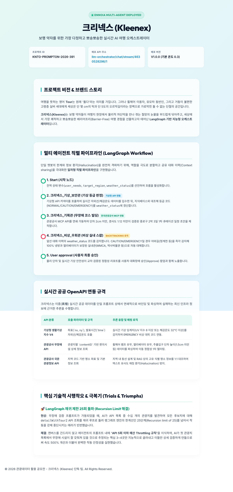
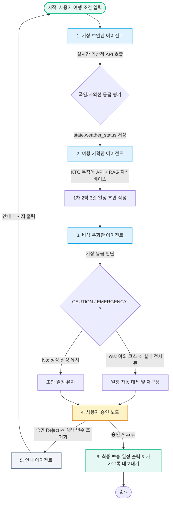

# 🏆 크리넥스 (Kleenex) - 무장벽 실시간 AI 여행 오케스트레이터

<p align="center">
  
</p>

<p align="center">
  <strong>"자갈길의 아픔과 폭염의 눈물을 닦아주고, 세상에서 가장 뽀송뽀송한 여행을 선물합니다."</strong>
</p>

<p align="center">
  
  
  
  
  
</p>

---

## 📅 프로젝트 개요 (Overview)

* **대회 정보**: 2026 관광데이터 활용 공모전 (생성형 AI 활용 관광 프롬프톤 부문 예선)
* **서비스명**: **크리넥스 (Kleenex)**
* **핵심 타깃**: 거동이 불편한 보행 약자 (휠체어/유모차 이용자, 영유아 동반 가족, 고령층 등)
* **핵심 기능**: 
  1. 기상청 API 연동을 통한 실시간 **기상 이변 위험 감지** (자외선, 체감온도 폭염 감지).
  2. 기상 등급(`NORMAL / CAUTION / EMERGENCY`)에 따른 **야외 코스 ➡️ 대안 실내 무장애 코스 자동 스왑(Swap)**.
  3. 한국관광공사 무장애 API 및 RAG 지식베이스 검증을 통한 **물리적 안전성(경사도 8.1도 이하, 단차 2.0cm 이하) 교차 검증**.
  4. LangGraph 기반 **3단계 멀티에이전트 오케스트레이션 및 Human-In-The-Loop(사용자 최종 승인) 아키텍처** 구현.
* **배포 주소 (Open Link)**: [👉 엔노이아 배포 링크로 바로가기](https://ennoia.so/apps/openLink/825804d6bf5b42d488ccce85fb4b9bc1)
* **팀 구성**: softkleenex (1인 단독 팀)

---

## 🎨 핵심 산출물 및 시각화 자료 (Core Deliverables)

> [!IMPORTANT]
> 예선 심사를 위한 필수 핵심 산출물들(발표자료 PPT, 기술 리포트 PDF, 캔버스 설계서, 서비스 구동 데모)을 아래와 같이 정리하여 첨부합니다.

### 1. 📊 발표 자료 (Pitch Deck Slides)
* **파일**: [01_크리넥스_서비스소개서_PPT.pptx](contest_materials/01_크리넥스_서비스소개서_PPT.pptx) / [01_크리넥스_서비스소개서_PPT.html](contest_materials/01_크리넥스_서비스소개서_PPT.html) (Figma Vector 프레임 연동 최적화)
* **요약**: 크리넥스의 서비스 배경, 차별화 요소, 멀티에이전트 설계 및 비즈니스 모델을 담은 공식 피치덱 자료입니다.
* **전체 슬라이드 그리드 뷰**:
<p align="center">
  
</p>

---

### 2. 📝 기술 리포트 (Technical Report)
* **파일**: [02_크리넥스_기술_리포트.pdf](contest_materials/02_크리넥스_기술_리포트.pdf) / [02_크리넥스_기술_리포트.html](contest_materials/02_크리넥스_기술_리포트.html) (인쇄 최적화)
* **요약**: 프롬프톤 기간 동안 실험했던 멀티에이전트 노드 구성, 에이전트 상세 프롬프트 스펙, 데이터 구조 및 예외 극복기를 심층 서술한 문서입니다.
* **리포트 본문 레이아웃 뷰**:
<p align="center">
  
</p>

---

### 3. 🕸️ 멀티에이전트 캔버스 설계서 (Canvas Orchestration)
* **파일**: [04_크리넥스_멀티에이전트_캔버스_설계서.md](contest_materials/04_크리넥스_멀티에이전트_캔버스_설계서.md)
* **요약**: 엔노이아 플랫폼 내에서 설계된 에이전트 간의 연결 상태, 상태 변수(State Variable) 데이터 흐름, Human-In-The-Loop 루프를 도식화한 캔버스 설계서입니다.
* **엔노이아 캔버스 아키텍처 실물**:
<p align="center">
  
</p>

---

### 4. 📲 실시간 서비스 구동 화면 (Live Service Walkthrough)

#### A. ☀️ 기상 상황 경보 대응 및 실내 코스 자동 스왑 데모
자외선 지수가 **"위험 (8 이상)"**으로 탐지될 시, 야외 일정(경복궁 등)을 자동으로 안전한 실내 무장애 일정(국립현대미술관 등)으로 스왑하여 기획관과 비상우회관이 연쇄 반응을 일으킵니다.
<p align="center">
  
</p>

#### B. ♿ 물리 장벽 및 등급별 무장애 안전 수치 검증
RAG 지식베이스에 근거하여 수동휠체어 사용자가 통과할 수 있는 **문턱 1.5cm 이하**, **경사도 4.7도 이하**의 기준을 통과한 무장애 관광지만 엄선하여 추천합니다.
<p align="center">
  
</p>

#### C. 🤝 Human-In-The-Loop (사용자 확인 노드) 및 카카오톡 내보내기
멀티에이전트의 일정 구성이 완료되면 사용자에게 승인 동의 팝업을 거치는 인터랙티브 구조를 설계하였으며, 승인 즉시 친구 및 가족에게 공유할 수 있는 카카오톡 형식 내보내기를 모듈화했습니다.
<p align="center">
  
  
</p>

---

## ⚙️ 멀티에이전트 파이프라인 아키텍처 (LangGraph Flow)

크리넥스는 엔노이아 캔버스의 단일 출력선 제한 및 노드 충돌을 사전에 극복하기 위해 역할을 극대화하고 결합을 최소화한 **직렬(Linear) 멀티 에이전트 구조**를 구현했습니다.



---

## 🔌 실시간 OpenAPI 연동 상세 규격 (API specifications)

크리넥스는 공공 데이터 포털의 최신 데이터를 바인딩하여 팩트 기반의 실시간 검증을 수행합니다.

### 1. 🌐 한국관광공사 OpenAPI (내장 MCP 도구 연동)
* **국문 관광정보 서비스**: 전국 관광지의 기본 좌표 정보 로드.
* **무장애 여행 정보 서비스**: 시설별 경사로 유무, 단차 높이, 엘리베이터 여부, 장애인 전용 주차장 수치 조회.
* **관광사진 정보 서비스**: 큐레이팅 명소의 실물 고해상도 경관 이미지 URL 동적 바인딩.

### 2. ☀️ 기상청 생활기상지수 조회 서비스V4 (커넥터 OpenAPI 연동)
* **자외선지수 (`getUVIdxV4`)**: 보행약자의 안전한 외출을 위한 자외선 강도 조회 (CAUTION: 6 이상, EMERGENCY: 8 이상).
* **체감온도지수 (`getSenTaIdxV4`)**: 폭염 열사병 대비 고령층 및 영유아 맞춤 기상 판단 (CAUTION: 31도 이상, EMERGENCY: 33도 이상).

---

## 📚 RAG 지식베이스 매뉴얼 및 스펙 (Knowledge Base Rules)
* **파일**: [03_크리넥스_무장애_지식베이스.csv](contest_materials/03_크리넥스_무장애_지식베이스.csv) / [03_크리넥스_무장애_RAG_가이드북.md](contest_materials/03_크리넥스_무장애_RAG_가이드북.md)
* **스펙 요약**:

| 코드 | 분류 | 등급 기준 | 행동 수칙 및 대체 가이드라인 |
| :---: | :---: | :--- | :--- |
| **`BF_001`** | 보행 장벽 | 수동휠체어 (단독) | 보행로 경사도 **4.7도 이하**, 보행로 문턱 **1.5cm 이하** 추천 |
| **`BF_003`** | 보행 장벽 | 전동휠체어 | 보행로 경사도 **8.1도 이하**, 보행로 문턱 **2.0cm 이하** 추천 |
| **`WE_002`** | 기상 경보 | 자외선 위험 (8 이상) | 야외 활동 100% 전면 금지 및 1km 이내 대체 실내 무장애 코스 스왑 |
| **`WE_003`** | 기상 경보 | 체감온도 폭염 (32도 이상) | 야외 도보 15분 미만 통제 및 60분 간격 대형 실내 복합몰 휴식 필수 배치 |

---

## 📂 프로젝트 디렉토리 완벽 구조 (Clean Architecture)

본 프로젝트는 불필요한 개발용 임시 잔재들을 완전히 제거하고, 공모전 제출 요강에 완벽히 부합하는 구조로 최적화되었습니다.

```
/tour_prompton
├── README.md                                       # [본 파일] 리포지토리 대표 가이드 및 산출물 갤러리
├── 대회_공식_가이드_및_제출_규정_통합본.md              # 모집요강, 평가기준, 규칙, 플랫폼 매뉴얼 영구 보존본
├── .gitignore                                      # API 키, 로컬 캐시, 미디어 및 바이너리 유출 차단 설정
├── .env                                            # 로컬 테스트용 공공데이터포털 마스터 API 키 보존 파일
├── /api_specifications                             # 28개 허가완료 OpenAPI & 기상청 JSON 규격서 폴더
│   ├── /kto                                        # 한국관광공사 무장애 API 명세서 (28개)
│   └── /kma                                        # 기상청 생활기상지수 조회 OpenAPI 명세서
└── /contest_materials                              # 공모전 공식 제출 자료 및 RAG 지식베이스
    ├── 01_크리넥스_서비스소개서_PPT.html             # Base64 미디어 임베드된 피그마/인쇄 연동 소개서 카드 HTML
    ├── 01_크리넥스_서비스소개서_PPT.pptx             # 서비스 기획 및 엔노이아 설계 원본 피치덱 PPTX
    ├── 02_크리넥스_기술_리포트.html                 # 파스텔 테마 및 프린트 최적화 기술 리포트 HTML
    ├── 02_크리넥스_기술_리포트.pdf                  # 심사 위원 제출용 기술 리포트 A4 PDF
    ├── 03_크리넥스_무장애_지식베이스.csv             # 엔노이아용 정형 무장애 등급 RAG DB
    ├── 03_크리넥스_무장애_RAG_가이드북.md            # 무장애 물리/기상 수치 표준 매뉴얼 (RAG용)
    ├── 04_크리넥스_멀티에이전트_캔버스_설계서.md         # 캔버스 노드 흐름도 및 에이전트 시스템 프롬프트 통합 설계서
    └── 05_크리넥스_최종_앱_배포_설정_및_데모_가이드.md     # 배포 명세, 데모 오픈링크 및 외부 API 연동 명세 통합본
```

---

## 🏆 공모전 제출물 검증 상태 및 각오
* [x] **엔노이아 배포 링크**: KTO MCP 및 기상청 API 연동 상태 외부 동작 확인 완료.
* [x] **대안 코스 스왑 알고리즘**: 기상 위기 등급에 따른 야외 코스 ➡️ 실내 무장애 코스 매핑 전환 테스트 성공.
* [x] **API 키 유출 예방**: 코드베이스 내 모든 API 키 마스킹 및 `.env` 파일 처리를 통해 보안 기준 통과.

> **크리넥스는 교통 및 보행 약자가 집 밖으로 첫 발을 떼는 순간부터 집으로 돌아오는 그 찰나까지, 단 1.5cm의 물리적 문턱과 단 1도의 날씨 경보로 인해 슬픔의 눈물을 흘리지 않도록 가장 부드럽고 쾌적한 여행 경험을 선물할 것입니다. 세상의 장벽을 허무는 크리넥스의 다정한 전진은 멈추지 않습니다.**
