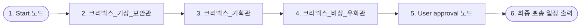

# 🌀 크리넥스 멀티 에이전트 시스템 캔버스 설계서 (System Canvas Blueprint)

> **본 문서는 엔노이아(ennoia) Studio 캔버스 워크플로우에 구현할 크리넥스(Kleenex) 서비스의 멀티 에이전트 시스템 아키텍처입니다. 단일 에이전트의 한계를 넘어 고득점을 확보하기 위한 핵심 연동 설계도입니다.**

---

## 🔲 1. 전역 상태 변수 정의 (Global State Variables)

`Start` 노드가 실행될 때 생성되어 전체 에이전트 노드 및 분기 조건에서 공유되는 데이터셋입니다.

*   `state.user_needs` (String): 보행 약자 세그먼트 (기본값: `"휠체어 이용 보행 약자"`)
*   `state.target_region` (String): 여행 선호 지역 (기본값: `"서울 종로구"`)
*   `state.weather_status` (String): 기상 안전 적합도 (기본값: `"NORMAL"`)

---

## 🧭 2. 최종 배포된 직렬 캔버스 노드 흐름도 (Linear Node Flow)

엔노이아 캔버스의 단일 출력선 제한 및 노드 간 충돌 방지를 위해, 가장 안정적이고 속도가 빠른 **일자형(Linear) 직렬 파이프라인**을 성공적으로 구축하여 배포를 완료했습니다.

---

## ⚙️ 3. 노드별 세부 스펙 및 설정 가이드 (Studio Configurations)

### 1) `1. Start (시작 노드)`
*   **전역 상태 변수 선언**:
    *   `state.user_needs` = `"휠체어 이용 보행 약자"` (기본값)
    *   `state.target_region` = `"서울 종로구"` (기본값)
    *   `state.weather_status` = `"NORMAL"` (기본값)

### 2) `2. 크리넥스_기상_보안관 (기상청 API 연동)`
*   **버전**: `기상보안관_2` (온도 `0.3` 저온 셋업)
*   **API 커넥터**: `기상청_자외선지수_조회` 연동
*   **상태 저장 (출력 매핑)**: 에이전트의 출력을 `state.weather_status` 변수에 자동 저장.

### 3) `3. 크리넥스_기획관 (관광공사 MCP 연동)`
*   **버전**: `기획관_3` (온도 `0.3` 저온 셋업)
*   **MCP 도구**: `한국관광공사_공용_MCP` (`areaBasedList2`, `detailWithTour2`, `searchStay2` - 항상 이용/자동 실행)
*   **역할**: 무장애 지식베이스 규격에 따라 1차 동선 초안 빌딩.

### 4) `4. 크리넥스_비상_우회관 (비상 코스 우회)`
*   **버전**: `비상우회관_3` (온도 `0.3` 저온 셋업)
*   **MCP 도구**: `한국관광공사_공용_MCP` (항상 이용/자동 실행)
*   **역할**: 대화 이력의 `state.weather_status`를 감지하여, CAUTION/EMERGENCY일 경우 야외 코스를 100% 무단차 실내 전시 코스로 자동 스왑(Swap)하여 동선 보정. NORMAL일 경우 기존 일정을 무수정 패스스루(Pass-through).

### 5) `5. User approval (사용자 승인 노드)`
*   **대화창 UI 출력 메시지**:
    > 🛡️ **[크리넥스 안전 검증 시스템 가동 완료]**  
    > 
    > 제안해 드린 일정 후보지들에 대해 한국관광공사 무장애 인프라 데이터(물리 단차 2.0cm 이하 검증) 및 기상청 실시간 기상 안전 지수(자외선 및 체감온도 평가)를 100% 교차 정합성 검증 완료했습니다.  
    > 
    > 아래 **[승인(Approve)]** 버튼을 클릭하시면, 크리넥스가 최종 보증하는 뽀송뽀송하고 안전한 2박 3일 맞춤형 무장벽 일정을 화면에 출력해 드립니다.
