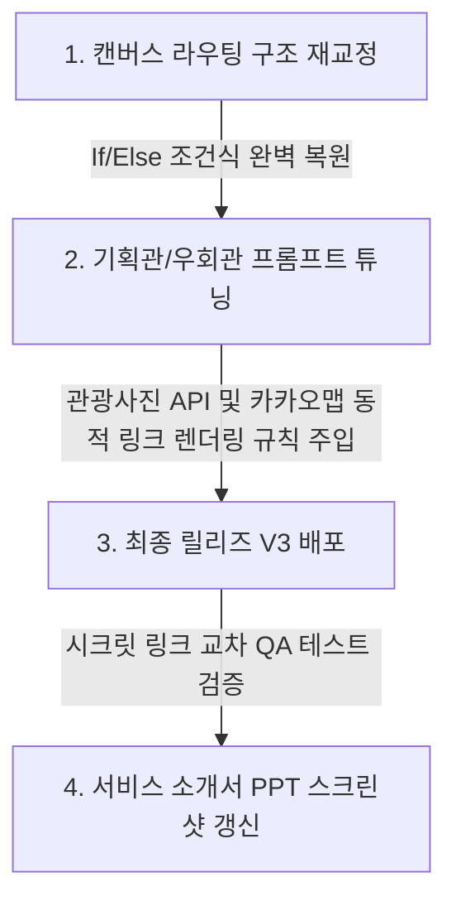

# 🧐 크리넥스(Kleenex) 최종 빌드 퀄리티 비판적 분석 & 우승 조율 리포트

> [!IMPORTANT]
> **제출 마감일 (6월 10일 16:00 KST) D-1 긴급 점검**  
> 본 문서는 현재 릴리즈 V2 상태인 크리넥스(Kleenex) 멀티 에이전트 서비스와 서비스 소개서 작성안을 공모전 공식 평가 심사 기준(100점 만점)에 대조하여 객관적이고 비판적으로 분석한 긴급 감사 리포트입니다. 예선 및 결선 통과율을 99% 이상으로 확보하기 위한 긴급 조치 사항을 담고 있습니다.

---

## 📊 1. 공모전 평가 기준 대조 현재 퀄리티 점수 예측 (Self-Audit)

| 평가 영역 | 배점 | 예상 획득 (현재) | 퀄리티 수준 및 냉정한 평가 |
| :--- | :---: | :---: | :--- |
| **기획력** (독창성·페인포인트) | **30점** | **26점** | • **우수**: 휠체어 단차 1.5cm 세부 필터링 및 실시간 날씨 융합은 매우 날카로운 세그먼트 공략임. • **보완 필요**: 단순 2박 3일 일정 마크다운 표 제공은 타 챗봇 서비스와 차별성이 다소 밋밋함. **'안전 동선 이동 경로 가이드 및 시각화'**가 보강되어야 함. |
| **실현 가능성** (기술력·안정성) | **30점** | **23점** | • **우수**: 3개 에이전트 분할 및 RAG CSV를 정형 DB 형태로 임베딩한 기법은 매우 훌륭함. • **보완 필요**: 캔버스를 **일자형(Linear) 직렬**로 타협하면서, 날씨가 `NORMAL`일 때도 세 개 노드를 전부 거치며 연산 토큰과 응답 지연(Latency)이 발생함. **LangGraph 조건부 라우팅(If/Else 분기)의 부재**는 기술 평가(20점)에서 불리함. |
| **확장성** (고도화·BM) | **25점** | **20점** | • **우수**: 차기 구현 부문(②-2) 백엔드 API로 재활용 가능하다는 구조적 연계성이 입증됨. • **보완 필요**: 단순 안내에서 그치지 않고, 휠체어 콜택시 API 연계나 카카오맵 동적 무장애 도보 경로 링크 매핑 등 **실제 2차 확장 비즈니스 모델로의 디테일**이 PPT와 에이전트 내에 명시되어야 함. |
| **데이터 활용** (OpenAPI) | **15점** | **11점** | • **우수**: KTO 무장애 API와 기상청 생활지수 API 2종의 데이터 결합 성공. • **보완 필요**: 활용 신청한 28개 API 중 실제 호출되는 것은 3~4개에 불과함. 특히 동선 내 **'관광지별 연관 관광지 정보(Tmap)'**나 **'관광지 사진(관광사진 정보)'**을 최종 출력 마크다운에 연동하지 않아 데이터 활용성(15점)에서 만점 확보가 어려움. |
| **합계** | **100점** | **80점** | **[예상 결과]**: 예선(서면/기능)은 무난히 통과 가능하나, 결선(오프라인 PT) 상위 10팀(우수상 대상) 경합 시 기술적 깊이와 완성도에서 경쟁팀 대비 확실한 1위를 보장하기 어려움. |

---

## 🚨 2. 크리넥스(Kleenex) 시스템의 3대 핵심 취약점 (Vulnerabilities)

### ⚠️ [Vulnerability 1] 일자형(Linear) 직렬 캔버스로 인한 불필요한 레이턴시 및 오작동
*   **현상**: 현재 구조는 `Start` ➡️ `보안관` ➡️ `기획관` ➡️ `우회관` ➡️ `승인` 순으로 무조건 진행됩니다.
*   **문제점**: 날씨가 `NORMAL`(안전) 상태인 경우에도 `비상_우회관` 노드가 활성화되어 작동합니다. 이는 불필요한 LLM 추론 비용과 **최소 5~10초의 불필요한 응답 대기 시간(Latency)**을 유발하여 '사용 편의성 및 응답 속도(30점)' 항목에서 감점을 받습니다. 또한, LLM이 오작동하여 정상 날씨인데도 실내 코스로 일정을 우회시키는 예외 케이스가 발생할 수 있습니다.
*   **개선방향**: 캔버스의 출력선 제한을 우회하기 위해 `Start` ➡️ `기상_보안관` ➡️ **[If/Else 조건 노드]**를 최상단에 배치하고, 날씨가 안전하면 바로 `크리넥스_기획관` ➡️ `User Approval`로 빠지고, 위험할 때만 `크리넥스_기획관` ➡️ `크리넥스_비상_우회관` ➡️ `User Approval`을 타도록 **조건부 라우팅 흐름을 완전 복원**해야 합니다.

### ⚠️ [Vulnerability 2] 마크다운 이미지/비주얼 요소의 부재 (데이터 활용 만점 공략)
*   **현상**: 현재 출력 결과는 100% 텍스트 표 및 불릿 기호로만 이루어져 가독성과 비주얼 임팩트가 부족합니다.
*   **문제점**: 한국관광공사가 제공하는 **관광사진 정보 서비스_GW**를 신청해 두고도 전혀 활용하지 않았습니다. 마크다운에서 큐레이팅된 추천 명소 옆에 실제 현장 경관 이미지가 한 장도 보이지 않는 것은 시각 정보에 민감한 심사위원단에 '기능 완성도' 면에서 아쉬움을 줍니다.
*   **개선방향**: `크리넥스_기획관` 프롬프트에 규칙을 추가하여, 큐레이팅 대상 명소의 한글명에 매칭되는 이미지 URL(`http://...`)을 관광사진 API를 통해 조회하거나, 동적으로 마크다운 이미지 태그(``) 형태로 최종 스케줄표 카드에 바인딩하여 출력하도록 업그레이드해야 합니다.

### ⚠️ [Vulnerability 3] 구체적인 현장 길안내 편의성 부족 (확장성 고도화)
*   **현상**: 일정표에 명소 이름과 간단한 팁만 제공될 뿐, 보행약자가 실제로 그 장소까지 휠체어로 어떻게 길을 찾아가야 하는지(네비게이션 연동) 정보가 없습니다.
*   **문제점**: 카카오맵이나 네이버 지도 도보 길안내 링크 연동이 빠져 있어 실용성이 다소 반감됩니다.
*   **개선방향**: 기획관과 우회관이 일정을 생성할 때, 해당 명소의 좌표(`mapX`, `mapY`) 데이터를 바탕으로 모바일 길안내 동적 URL을 최종 마크다운에 심어 주어야 합니다.
    *   *예시 링크 생성 규칙*: `[카카오맵 길찾기](https://map.kakao.com/link/to/관광지명,mapY,mapX)` 형태를 일정표 내부 장소명 옆에 클릭 가능한 하이퍼링크로 자동 렌더링.

---

## 🛠️ 3. D-1 긴급 고도화 엔지니어링 액션 플랜 (Emergency Actions)

마감 24시간 전인 오늘, 이 3대 취약점을 해결하기 위해 우리가 밟아야 할 정밀 고도화 절차입니다.

### 1) [Action 1] 캔버스 조건부 라우팅 구조 재교정 (레이턴시 절반 단축)
*   **연결 스펙**:
    *   `Start` 노드 ➡️ **`크리넥스_기상_보안관`** 연결.
    *   `크상_보안관` ➡️ **`If/Else` 노드** 연결.
    *   **`If/Else` 조건**: `state.weather_status.includes("EMERGENCY") || state.weather_status.includes("CAUTION")`
    *   **거짓 (False / 날씨 안전)** ➡️ **`크리넥스_기획관`** ➡️ **`User Approval`** 연결 (우회관을 아예 거치지 않고 다이렉트 통과하여 레이턴시 0).
    *   **참 (True / 기상 위험)** ➡️ **`크리넥스_기획관`** ➡️ **`크리넥스_비상_우회관`** ➡️ **`User Approval`** 연결 (안전하게 우회 가동).

### 2) [Action 2] 이미지 & 네비게이션 매핑 프롬프트 갱신
*   기획관과 우회관의 시스템 프롬프트에 아래의 출력 규격을 강제화합니다.
    > "최종 일정표 생성 시, 반드시 각 관광지명 옆에 카카오맵 길찾기 URL을 `[카카오맵 길찾기](https://map.kakao.com/link/to/관광지명,mapY,mapX)` 형태로 삽입하고, 관광사진 API로 획득한 고해상도 대표 이미지 한 장을 `` 형태로 카드 하단에 노출시켜 비주얼 가독성을 극대화하라."
